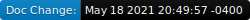

.. WhatsUpDoc documentation master file, created by
   sphinx-quickstart on Mon May  3 22:05:43 2021.
   You can adapt this file completely to your liking, but it should at least
   contain the root `toctree` directive.

WhatsUpDoc's Documentation
======================================

| |code|
| |doc|

**Prologue**

Here I embark on a project to document my thoughts and learning about documentation of scientific software. 
My goal is collect and summarize as I learn more and formulate my ideas. Therefore this doc will have two 
sections. A working edge, we're my I keep my current thoughts and a more polished section where I apply 
what I learned to explain my approach to documentation. Right now eveything is the working edge! 

.. toctree::
   :maxdepth: 2
   :caption: Contents:

   Books <Books>
   Useful Websites <UsefulWebsites>
   Example Docs to Snoop <ExampleDocsToSnoop>
   Currently Underdevelopment <Dev> 
   Random Thoughts <RandomThoughts>

==========================
Currently Underdevelopment
==========================
Using reStructuredText and Sphinx to make this website!

*TODO:*

* Add links to example documentation.
* Summarize thoughts on some their Youtube tutorials.
* User-Developer differences. 
* Automated dates for last time code was updated and last time documentation was updated. Also, graphical representation? 

*Ideas:*

Gallery of projects using the code with a short description accompanying each example. This way people can search
through others work to find examples, and people can promote their own work. 

Auto-glossary for in-house terms. Special terms are developed in-house for ease of communication. This facilitates in-house development and should be kept, but an auto-glossary for these terms would help incoming audience. 

Audience definitions should include our own development team, and users as technically literate but unfamiliar. Audience definitions? 

What about spell cehck?

Indices and tables
==================

* :ref:`genindex`
* :ref:`modindex`
* :ref:`search`
